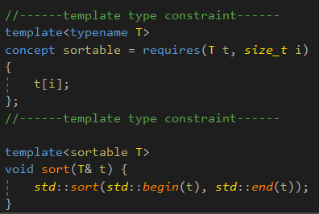
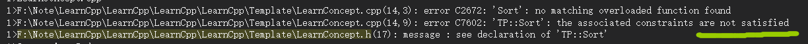
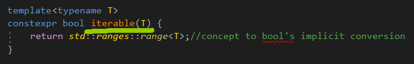
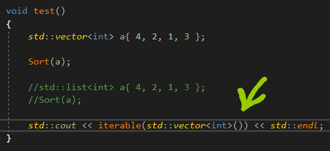
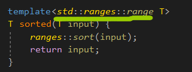
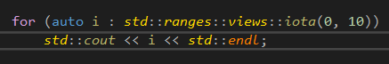
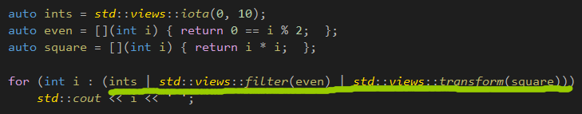
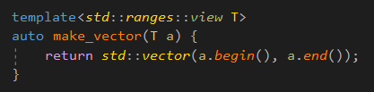
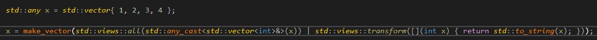

https://blog.csdn.net/lycheng1215/article/details/106879868，暂时的一篇好文章。




concept要求类型T可以通过[]进行访问。


然后在下面的泛型函数的模板参数typename，**替换成sortable。**




如果类型T不满足，那么会出现这样的错误。


如果不使用concept，则会实例化很深的时候，才出错。


# range

```c++
template<class T>
concept range = requires(T&& t){
	ranges::begin(T(t));
	ranges::end(T(t));
};
```

这里要求t拥有**复制构造函数。**

ranges::begin()和ranges::end()利用概念保证了返回类型一定是一个有效的迭代器。




可以用concept来判断一个类型是否是可迭代的。


concept能够隐式地转换成bool值。




判断一个对象是否是可迭代的。




要求T是可以迭代的，并且ranges提供了一个ranges::sort，用来排序。


如果只想对前半部分排序呢？


# view

视图view。


Python中，经过切片操作后，会生成一个指向原实体的对象，这就是视图。

视图的复制、移动应该是常数时间。


C++20的视图建立在范围的基础上，视图是一个概念，**并且视图是一个范围。**


```c++
template<class T>
concept view = ranges::range<T> && std::semiregular<T> && ranges::enable_view<T>;
```


ranges::enable_view&lt;T&gt;表示T是一个空类view_base的派生类。

std::semiregular&lt;T&gt;表示T可以复制也可以默认构造。


规定：view_base类型的对象可以在常数时间内进行复制、移动或者赋值。

如果不行，这个对象不应该是view_base类型的对象。


称一个类型满足视图概念的对象为一个**可迭代视图。**



iota是一个函数，或者仿函数，返回一个可迭代视图。


iota_view的begin和end方法返回一个合法的迭代器。


# range adaptor


范围适配器。


范围适配器的作用是得到一个**可迭代对象(range)的可迭代视图(view)。**

1.将可迭代对象作为参数传入一个范围适配器(范围适配器是一个防函数)

2.将可迭代对象作为二元运算符|的左操作数，将范围适配器作为右参数，则表达式的结果是一个可迭代视图。

|运算符的重载由范围迭代器提供。


范围适配器接受**可视图化范围(viewable_range)。**

 由于concept的引入，viewable_range有一个准确的定义：

```c++
template<class T>
	concept viewable_range = 
		ranges::range<T> && (ranges::borrowed_range<T> || ranges::view<std::remove_cvref_t<T>>);
```


一个类型如果是一个viewable_range，仅当它是一个可迭代对象，并且它要么是一个borrowed_range，

要么本身就是一个视图。




过滤不是偶数的，然后再平方。


**如何将任意可迭代对象转换为范围**，可以使用views::all。


Python的x = list(map(lambda i : str(i), x))，map对第二参数开始的参数，调用第一个函数，将x转换成字符串，

然后返回元组。




把视图转换为vector的操作。

实现类似的操作。



这里是把vector里面的**每个元素变成字符串。**


any_cast是强制类型转换，将x转换成std::vector&lt;int&gt;。


https://zhuanlan.zhihu.com/p/386392397，神秘的std::any。


