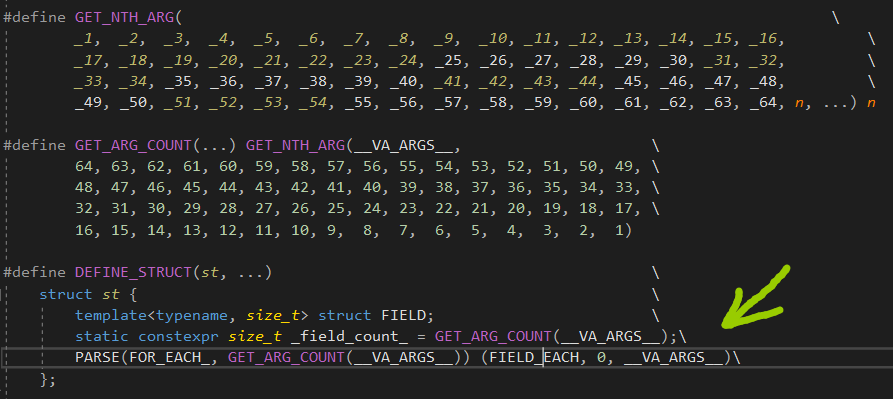
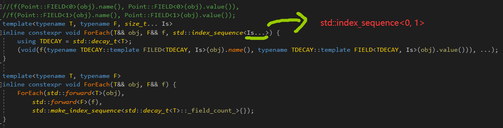
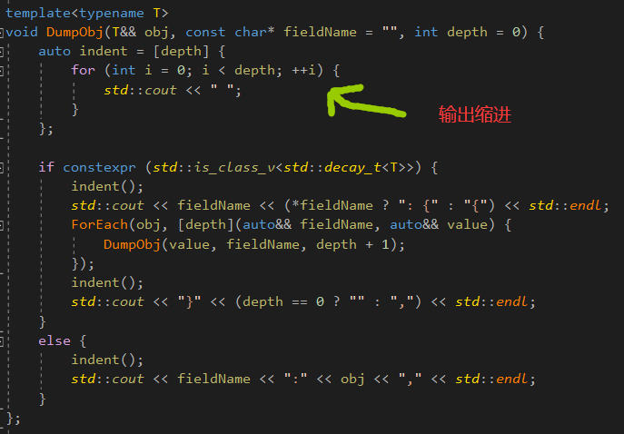

```c++
struct AnyType {
	template<typename T>
	operator T();
};

template <typename T, typename = void, typename ...Ts>
struct CountMember {
	constexpr static size_t value = sizeof...(Ts) - 1;
};

template <typename T, typename ...Ts>
struct CountMember < T, std::void_t<decltype(T{ Ts{}... }) > , Ts... > {
	constexpr static size_t value = CountMember<T, void, Ts..., AnyType>::value;
};
```


这段代码，是数类的成员个数。


decltype是求类型，因为参数是一个对象，所以要用decltype求一下类型，然后std::void_t只会在类模板参数有效的时候，给出void类型，从而匹配第一个主模板，只会在AnyType有四个的时候才会这样。





FOR_EACH宏，作用是执行元宏FIELD_EACH一定次数(字段数量)，而FIELD_EACH接收两个参数：

当前字段id(用于生成FIELD<T,id>)

当前字段声明信息，例如(double)x，用于定义double x，并实现FIELD<T, id>内容




(f(value, name), ...)会展开，会对每个字段的value和name调用f函数，f函数接收两个参数。


这是一个访问者模式，传入一个接收两个参数的函数，调用每个字段的value和name函数。

加void是因为，如果不使用返回类型，会报警告，加了，是把返回值强制转换一下。





